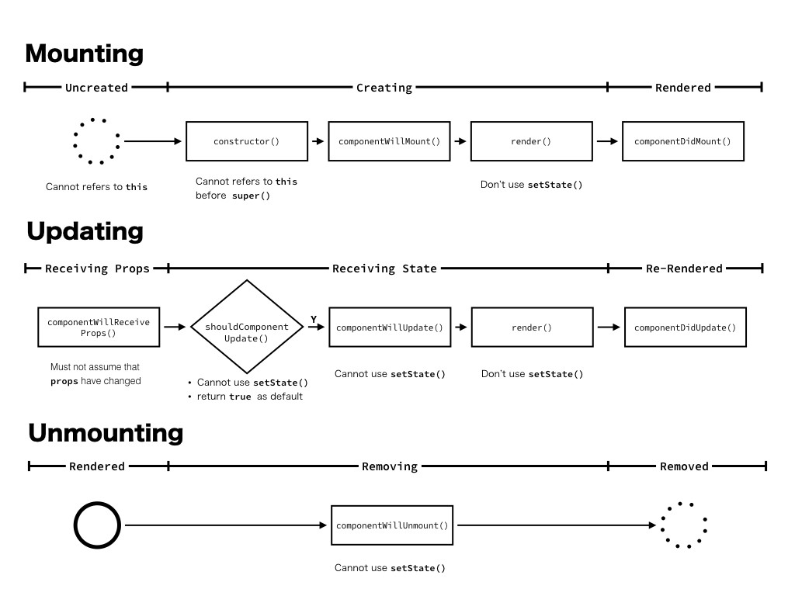

> 컴포넌트

- 컴포넌트는 클래스/함수로 작성한다.
- 컴포넌트 함수는 대문자로 시작
- Hello.js

```jsx
import React from 'react';

function Hello() {

	return <div>안녕하세요</div>;

}

export default Hello;
```

- App.js

```jsx
import React from 'react';

import Hello from './Hello';

function App() {

	return (

		<div>
		
			<Hello />
		
		</div>
	
	);

}

export default App;
```

---

> React 컴포넌트

- `props`를 input으로 하고 UI가 어떻게 보여야 하는지 정의하는 React Element를 output으로 하는 함수
- 컴포넌트는 각 프로세스가 진행될 때에 따라 Lifecycle 함수로 불리는 특별한 함수가 실행됩니다.
- Lifecycle 함수 다이어그램



- Mouting: Creating 중인 `componentWillMount()`에서 Ajax 요청을 날리면 응답 시간만큼 컴포넌트를 그리는 것이 늦어지는 것을 알 수 있습니다. 따라서 일반적으로 `componentDidMount()`에서 Ajax 요청을 하는 게 낫다는 것을 알 수 있다.
- Updating: Receiving State 중에 `setState()` API를 호출하면 프로세스가 끝난 후 또다시 Receiving State 할 것을 알 수 있습니다. 따라서 `setState()` API를 해당 Lifecycle 함수에서 호출하면 개념적으로 무한 루프에 빠질 수밖에 없다는 것을 알 수 있다. (물론 실제로도 무한 루프에 빠지게 됩니다.)